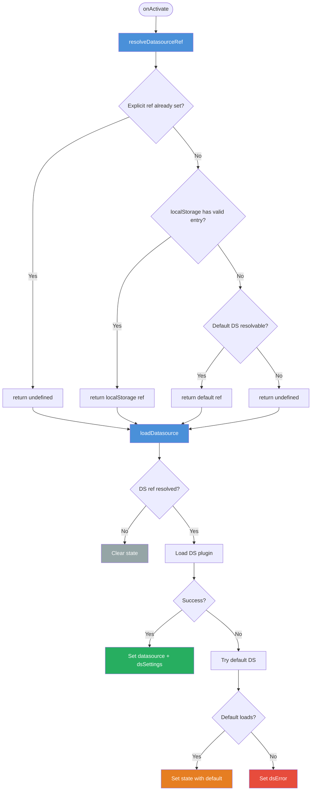
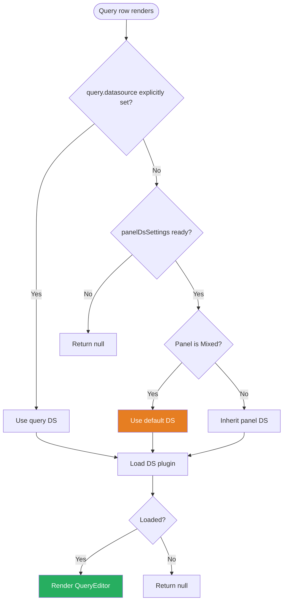
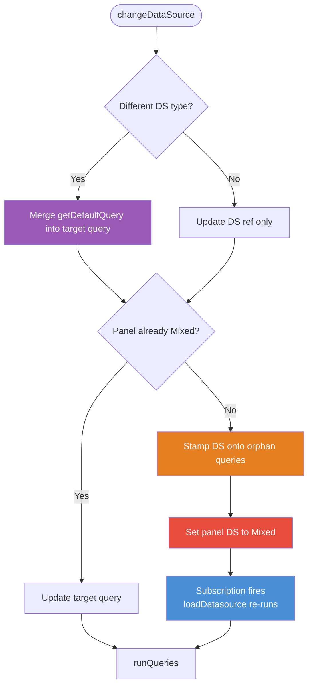
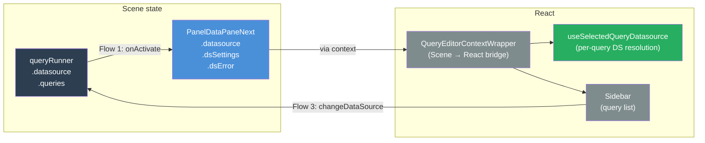

# PanelEditNext — Datasource Logic

## The core difference from v1

V1 had a panel-level datasource picker. Every datasource change in the editor — whether on open or from user interaction — flowed through a single method: `onChangeDataSource`. That method owned everything: it updated `queryRunner`, handled the Mixed transition, then explicitly called `loadDataSource`. One entry point, one class, no subscription needed.

```
V1 entry points
───────────────
onActivate → loadDataSource()
user picks DS → onChangeDataSource() → queryRunner.setState() → loadDataSource()
```

V2 removes that top-level picker. Every query row has its own per-query datasource selector. That one change is the reason the logic looks more spread out — it's the same v1 logic, just forced across three callsites instead of one class.

```
V2 entry points
───────────────
onActivate → resolveDatasourceRef() + loadDatasource()
user picks DS per query → changeDataSource() → queryRunner.setState(Mixed) → subscription → loadDatasource()
per query row render → useSelectedQueryDatasource()
```

The subscription is the only genuinely new wiring. V1 didn't need it because `onChangeDataSource` called `loadDataSource` explicitly. In V2, `changeDataSource` writes Mixed to `queryRunner.state` and the subscription reacts — because there's no longer a single method that owns the whole transition.

---

## The three `queryRunner.state.datasource` states

```
undefined              →  "use the configured default"
                          Panels saved without an explicit selection arrive this way.

{ uid, type }          →  Explicit panel-level datasource.
                          All queries inherit this unless they set their own datasource property.

{ uid: '-- Mixed --' } →  Mixed mode.
                          Every query MUST carry its own explicit datasource property.
                          The Mixed plugin has no QueryEditor — it only delegates.
```

---

## Flow 1 — Panel editor opens (`onActivate`)

V1 did all of this inline in a single `loadDataSource`. V2 splits it into a sync resolution step and an async load step, with one important difference: `resolveDatasourceRef` **returns** a ref rather than writing it to `queryRunner`. V1's equivalent code wrote directly to `queryRunner.setState` in the localStorage path. Both the V1 and V2 serializers read `queryRunner.state.datasource` on save, so that mutation would silently bake an explicit UID onto panels that were saved without one.



**Resolution priority** (mirrors v1's `loadDataSource`):

| Priority | Condition                                            | Action                                                 |
| -------- | ---------------------------------------------------- | ------------------------------------------------------ |
| 1        | `queryRunner.state.datasource` is set                | Return `undefined` — `loadDatasource` uses it directly |
| 2        | `queries[0].datasource` is set                       | Return `undefined` — same                              |
| 3        | localStorage has a resolvable UID for this dashboard | Return that `DataSourceRef`                            |
| 4        | `config.defaultDatasource` is resolvable             | Return the default `DataSourceRef`                     |

---

## Flow 2 — Per-query editor rendering (`useSelectedQueryDatasource`)

This is what replaces the panel-level picker in the UI. V1 rendered a single `<QueryGroupTopSection>` with one shared datasource for all query rows. V2 has no equivalent — instead, each query row independently resolves its own datasource to render the right query editor.



The Mixed special-case exists because the Mixed plugin has no `QueryEditor` component — it only delegates to per-query datasources. If a query has no explicit datasource and the panel is in Mixed state (common during transitions), falling back to the configured default keeps the query editable.

---

## Flow 3 — User changes a query's datasource (`changeDataSource`)

V1's equivalent was `onChangeDataSource` — called once for the whole panel, it updated `queryRunner` and called `loadDataSource` explicitly. V2's `changeDataSource` is called per query, and instead of calling `loadDatasource` directly, it writes to `queryRunner.state` and lets the subscription handle the reload.



**Orphan stamping:** before the Mixed transition, any query without an explicit `datasource` property would inherit from the panel — but the panel is about to become `-- Mixed --`, which has no QueryEditor. `changeDataSource` stamps the current panel DS ref onto every orphan first. This is identical to v1's behavior in `onSelectQueryFromLibrary`.

---

## How the three flows connect



---

## Key files

| File                                              | Role                                                                           |
| ------------------------------------------------- | ------------------------------------------------------------------------------ |
| `PanelDataPaneNext.tsx`                           | Owns Flows 1 & 3. The v2 equivalent of `PanelDataQueriesTab`.                  |
| `QueryEditorContextWrapper.tsx`                   | Scene → React bridge. Passes state to all child components via context.        |
| `QueryEditor/hooks/useSelectedQueryDatasource.ts` | Flow 2. Replaces the v1 panel-level datasource picker for each query row.      |
| `QueryEditor/Sidebar/`                            | Query list. Each row triggers `changeDataSource` (Flow 3) on DS picker change. |
| `PanelDataPane/PanelDataQueriesTab.tsx`           | The v1 equivalent — single monolithic `loadDataSource` + `onChangeDataSource`. |
